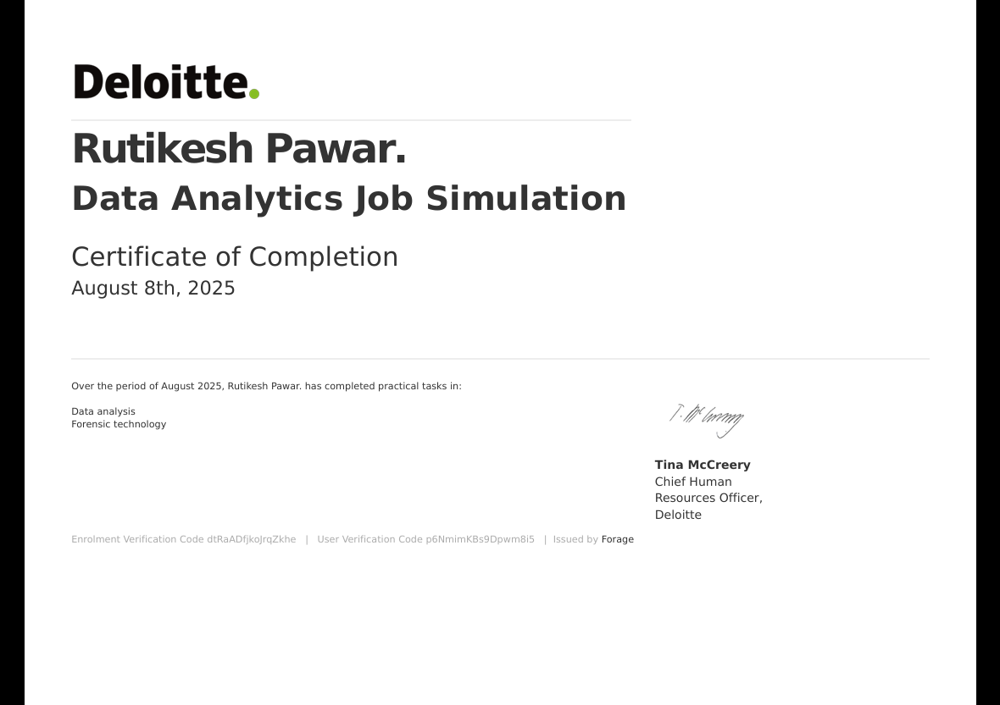

# 📜 Professional Certificates – Rutikesh Pawar

This repository contains verified certificates earned from Devtown, Simplilearn, and other learning platforms.

---

## 📊 ExcelR Data Analytics Certification

- 🔗 [View Certificate PDF](./ExcelR_DA_Certificate_Rutikesh.pdf)  

> Completed with distinction. Skills covered: SQL, Excel, Power BI, Tableau, Python, EDA, ML, Dashboarding.

--- 

## ✅ Devtown Certificates
### Python Zero to Hero

### 🏆 Certificate of Appreciation  
- 🔗 [View PDF](./devtown_python_zero_to_hero/devtown_appreciation.pdf)  

### 🎓 Certification of Participation  
- 🔗 [View PDF](./devtown_python_zero_to_hero/devtown_participation_python_zerotohero.pdf)  

### 💼 Certificate of Project Completion (Devtown)  
- 🔗 [View PDF](./devtown_python_zero_to_hero/devtown_google.pdf)  

### 🧠 Certificate of Project Completion (Devtown)
- 🔗 [View PDF](./devtown_python_zero_to_hero/devtown_microsoft.pdf)  

--- 

### 🧾 Devtown - SQL for Analyst Workshop  
- 🔗 [View PDF](./devtown_sql_for_analyst/devtown_sql_analyst.pdf)  

---

## 📊 Simplilearn – Introduction to Data Analytics  
- 🔗 [View PDF](./simplilearn/simplilearn_intro_data_analytics.pdf)  

---

## 🧪 Published Research Paper

### 📄 Machine Learning-Based [CROPIFY] – IJCRT  
- 🔗 [View Full Paper (PDF)](https://www.ijcrt.org/papers/IJCRT24A4305.pdf)  
- 🔗 [Official Journal Page](https://ijcrt.org/viewfull.php?&p_id=IJCRT24A4305)
- 🔗 [View PDF](./IJCRT/IJCRT.pdf)

> Published in the International Journal of Creative Research Thoughts (IJCRT), April 2024.  

---

## 🛠️ Guardneer Data Analyst Internship Certificate

- 🔗 [View PDF Certificate](./guardneer_intership/internship_gardneer.pdf)  

> Completed a 6-month professional internship as a Data Analyst, working on real-world projects in smart farming, water quality analytics, and customer segmentation.
> Tools used: Python, SQL, Excel, Tableau.

## 🛠️ Deloitte Certificate

- 🔗 [View PDF Certificate](Deloitte-Certification/Deloitte Certification.pdf)  

> ✅ These certifications validate my ongoing learning in data analytics, cloud, SQL, and real-world business intelligence tools.
