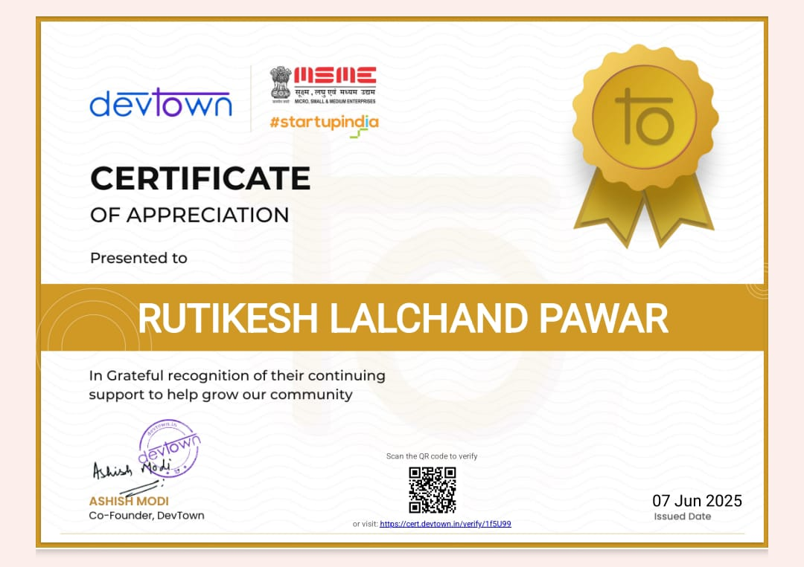
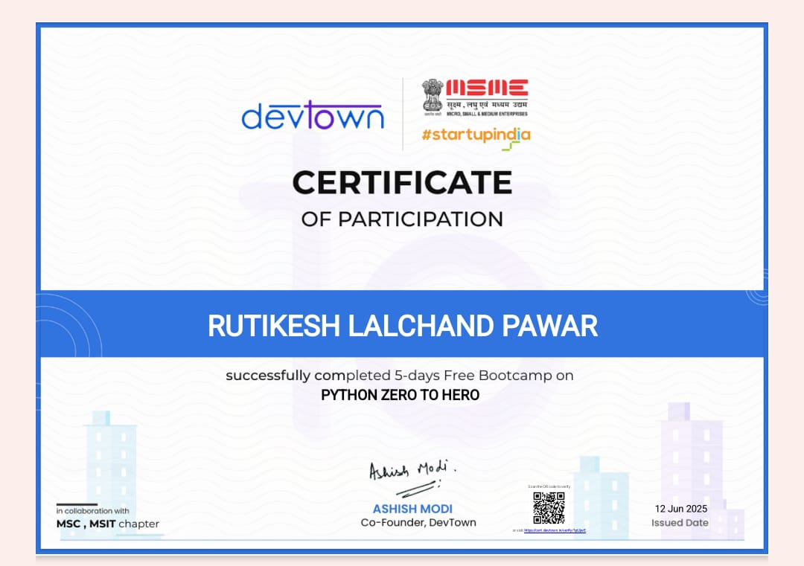
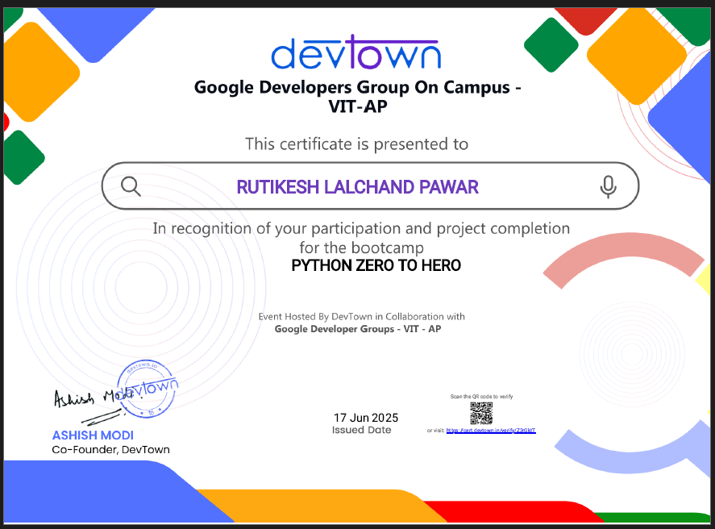
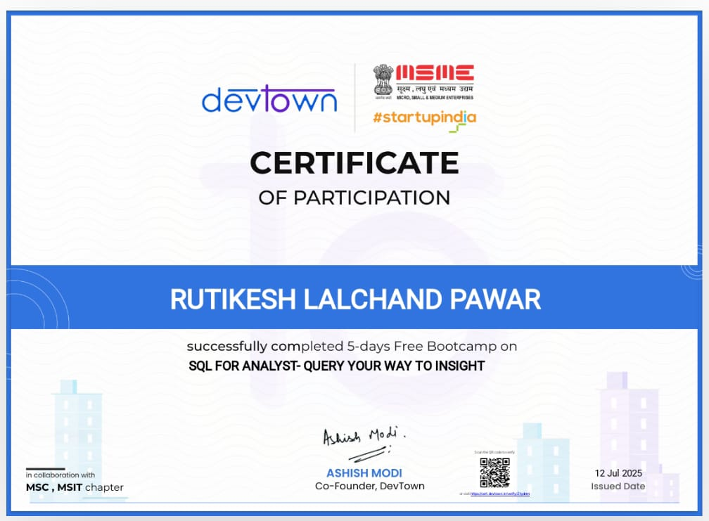

# 📜 Professional Certificates – Rutikesh Pawar

This repository contains verified certificates earned from Devtown, Simplilearn, and other learning platforms.

---

## ✅ Devtown Certificates

### 🏆 Certificate of Appreciation  
- 🔗 [View PDF](./devtown_python_zero_to_hero/devtown_appreciation.pdf)  

### 🎓 Certification of Participation  
- 🔗 [View PDF](./devtown_python_zero_to_hero/devtown_participation_python_zerotohero.pdf)  

### 💼 Google Cloud Virtual Internship (Devtown)  
- 🔗 [View PDF](./devtown_python_zero_to_hero/devtown_google.pdf)  

### 🧠 Microsoft Azure Fundamentals Workshop  
- 🔗 [View PDF](./devtown_python_zero_to_hero/devtown_microsoft.pdf)  

### 🧾 SQL for Analyst Workshop  
- 🔗 [View PDF](./devtown_sql_for_analyst/devtown_sql_analyst.pdf)  

---

## 📊 Simplilearn – Introduction to Data Analytics  
- 🔗 [View PDF](./simplilearn_intro_data_analytics.pdf)  

---

> ✅ These certifications validate my ongoing learning in data analytics, cloud, SQL, and real-world business intelligence tools.
