# 📜 Professional Certificates – Rutikesh Pawar

This repository contains verified certificates earned from Devtown, Simplilearn, and other learning platforms.

---

## 📊 ExcelR Data Analytics Certification

- 🔗 [View Certificate PDF](./ExcelR_DA_Certificate_Rutikesh.pdf)  
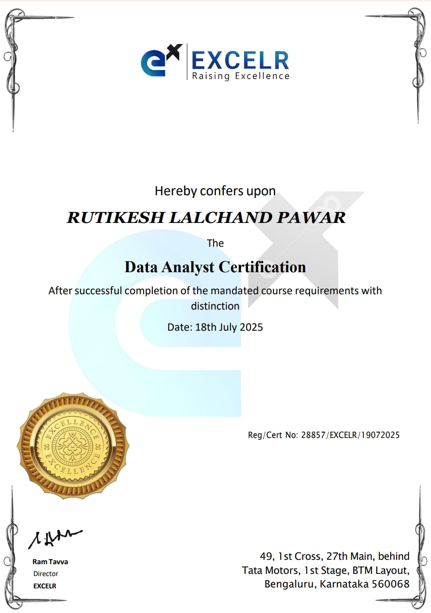

> Completed with distinction. Skills covered: SQL, Excel, Power BI, Tableau, Python, EDA, ML, Dashboarding.

--- 

### 💼 Internship Achievement – Aivariant

**Data Analyst Internship – Aivariant**  
- **Duration:** 03 Apr 2025 – 03 Oct 2025  
- **Recognition:** Successfully completed internship project  
- **Key Focus Areas:**  
  - Data Cleaning, Processing, and Visualization  
  - SQL, Excel, Tableau, and Python for Data Analytics  
  - Real-world business problem solving  
  - Reporting actionable insights for decision-making  

📂 [Download Certificate (PDF)](./ExcelR_Intership_Certificate/AIVariant_Internship_Certificate.pdf)  

📸 Certificate Preview:  
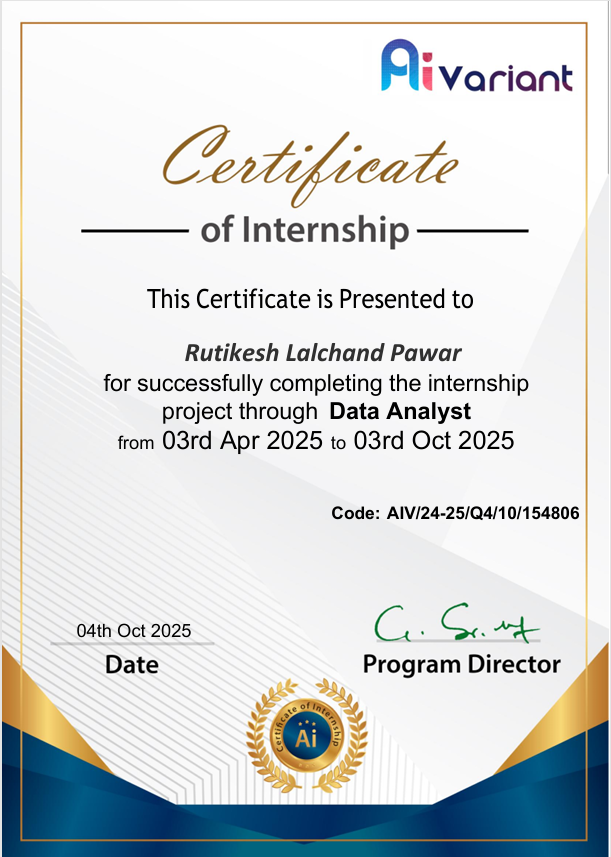

## 🚀 Internship Achievement

**Data Analyst Internship – Elevate Labs**  
- **Duration:** 04 Aug 2025 – 20 Sept 2025  
- **Recognition:** Best Performer ⭐  
- **Key Focus Areas:**  
  - Data Cleaning & Analysis  
  - SQL, Python, Excel, Tableau  
  - Real-world problem solving  

📂 [Download Certificate (PDF)](https://github.com/rutikeshpawar/Rutikesh-Certificates/blob/4bd93bc3611dc1206c060acc4b3f33e074ad5a24/Elavate_Lab/Elevate_Lab_Certificate.pdf)  

📸 Certificate Preview:  
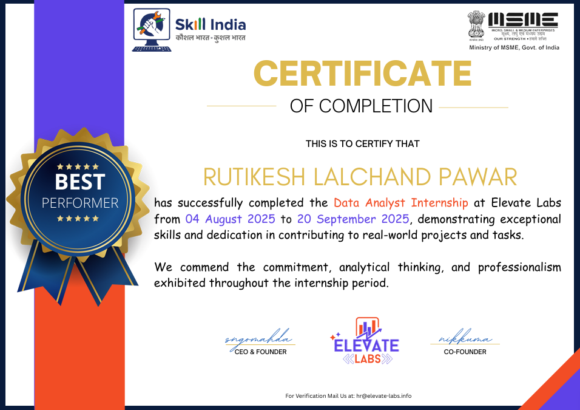

## 🏅 Featured Certification

### NASSCOM Certificate Program in Data Analyst  
- **Issued by:** IT-ITeS Sector Skills Council NASSCOM  
- **Date of Issue:** 14/09/2025  
- **Certification ID:** FSP/2025/9/10241684  
- **Category:** Gold  
- **Score:** 92%  

📂 [View Certificate PDF](./nasscom.pdf)  

### 📸 Certificate Preview
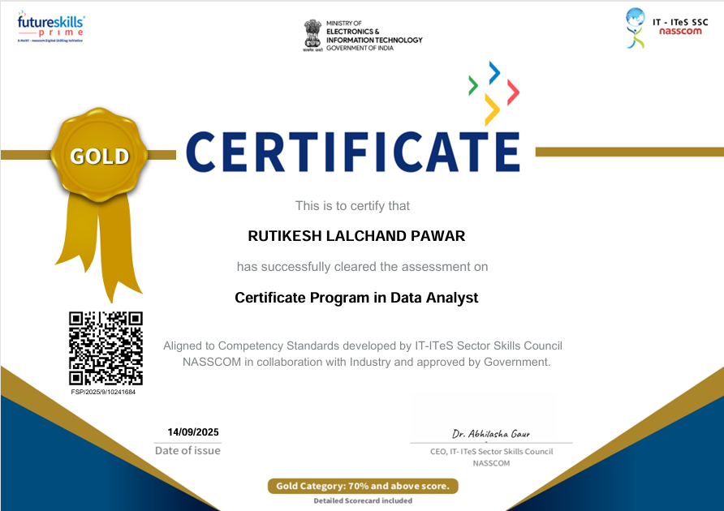

### 📸 Certificate Preview
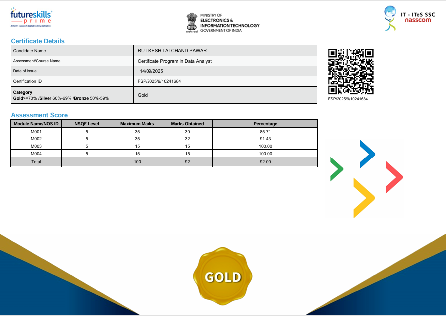

---

## 🎓Oracle  Professional Certifications

## 🏆 Oracle Certified Professional – Analytics Cloud 2025

**Certification:** Oracle Analytics Cloud 2025 Certified Professional  
**Issued by:** Oracle University  
**Date of Issue:** 28 October 2025  
**Valid Until:** 28 October 2027  
**Credential ID:** 322116401OCIEA25OCP  

📂 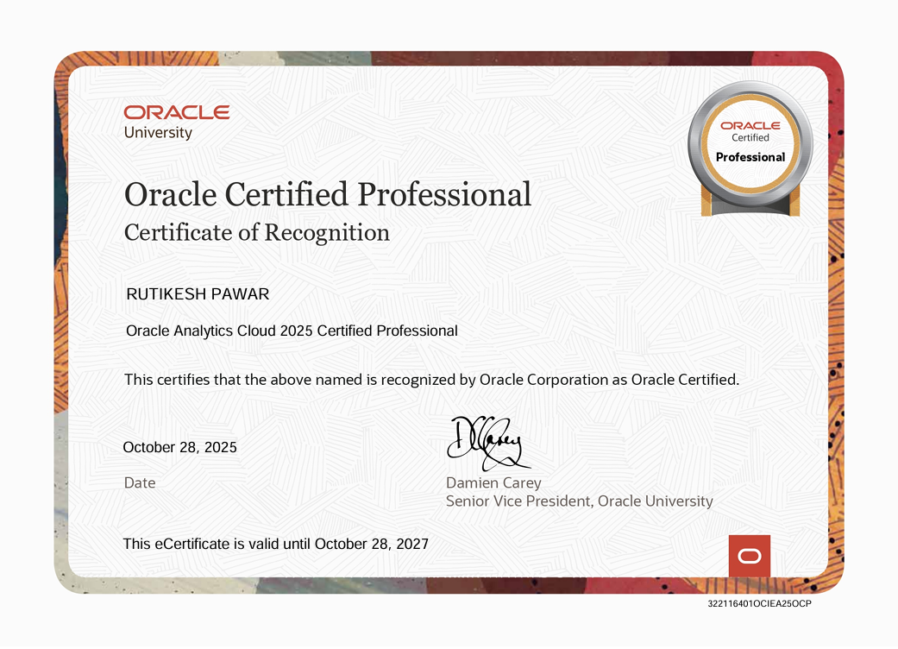

📂 [View Full PDF Certificate](oracle-certifications/Oracle_Analytics_Cloud/Oracle_Analytics_Cloud.pdf)

📸 Badge Preview:  
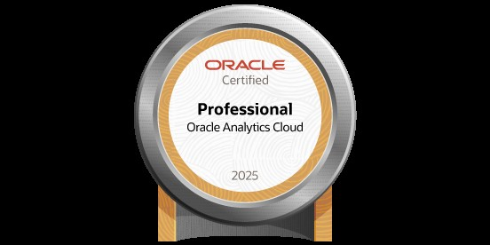

### 🎯 Skills Validated:
- Advanced Oracle Analytics Cloud Functions  
- Data Visualization & Dashboard Design  
- Cloud-based Data Modelling  
- Machine Learning in Oracle Analytics  
- Data Integration and Business Insights  

---

This certification validates my professional-level expertise in **Oracle Analytics Cloud**, empowering me to build intelligent, data-driven solutions using Oracle’s cloud analytics platform.

## Oracle Certified Foundations Associate
**Issued by:** Oracle University  
**Certificate ID:** 3221164010CIC25DCFA  
**Issue Date:** September 03, 2025  
**Valid Until:** September 03, 2027  

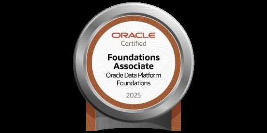

---

### 📜 Certificate (Preview)
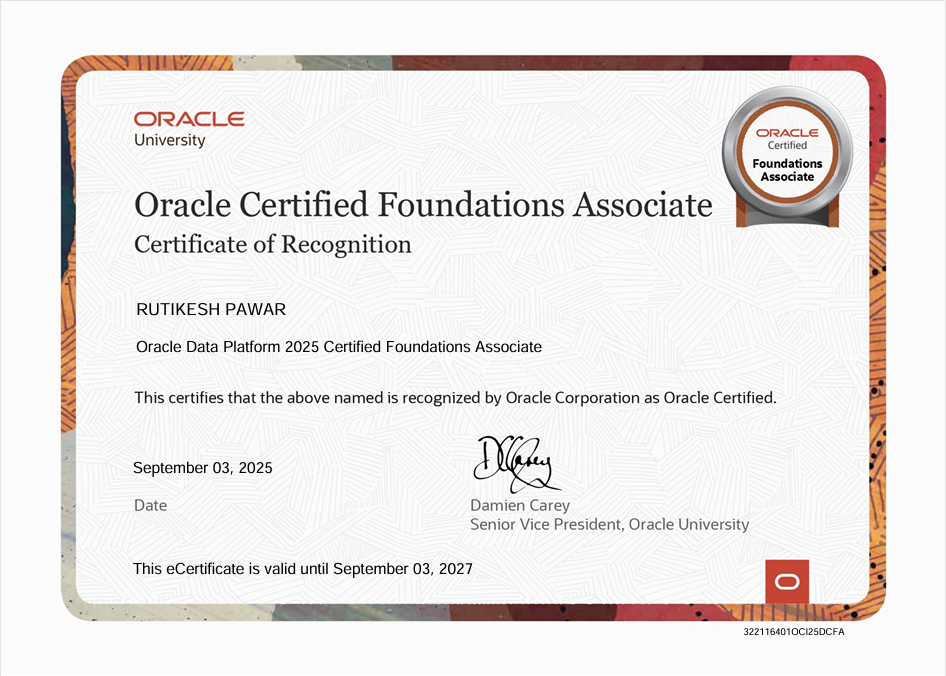

📂 [View Full PDF Certificate](oracle-certifications/data_platform/data_platform.pdf)

🔗 [Bagde Link](https://catalog-education.oracle.com/pls/certview/sharebadge?id=45EA605BA40004C8B27D35A41BB5F400722589C68A321F67D0BB8CEE780F2DFE)

---

### 🌟 Why this Certification Matters
This certification validates my foundational skills in:
- Oracle Data Platform
- Database fundamentals
- Data management & analytics concepts  

It strengthens my path as a **Data Analyst & Data Scientist** by showcasing my ability to work with enterprise-level database systems.

---

--- 

## Oracle Cloud Infrastructure 2025 Certified Data Science Professional

- **Issued by:** Oracle  
- **Date:** August 2025  
- **Credential ID:** 102439166OCI25DSOCP  

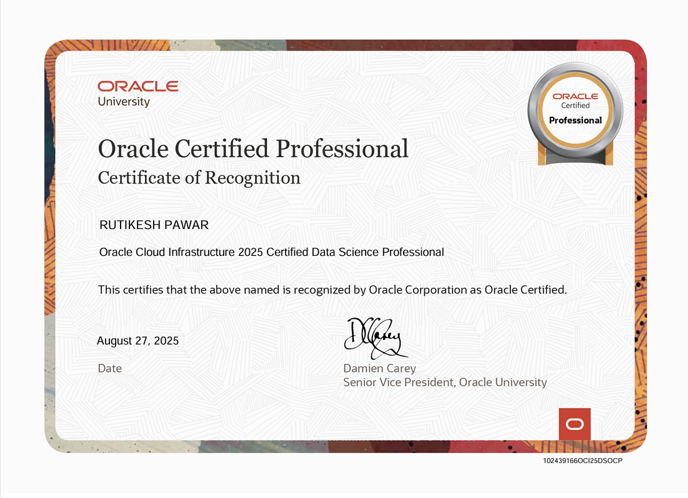

📄 [View Full Certificate (PDF)](oracle-certifications/OCI_DS_Certificate.pdf)

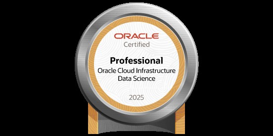

🔗 [Bagde Link](https://catalog-education.oracle.com/pls/certview/sharebadge?id=45EA605BA40004C8B27D35A41BB5F4008A95D96B2130E4F33D9EBA86278EEFC1)
---

This certification validates my skills in:

- Data Science & Machine Learning  
- Statistical Modeling & Predictive Analytics  
- SQL & Data Querying  
- Cloud-based Data Analytics (Oracle Cloud Infrastructure)  
- Model Deployment & Automation  

---

## 🤖 Oracle Certified Professional – Generative AI 2025

**Certification:** Oracle Cloud Infrastructure 2025 Certified Generative AI Professional  
**Issued by:** Oracle University  
**Date of Issue:** 30 October 2025  
**Valid Until:** 30 October 2027  
**Credential ID:** 322116401OCI25GAIOCP  

📂 [View Certificate (PDF)](./oracle-certifications/Oracle_Generative_AI/Generative_AI_Certificate_SS.pdf)

📸 Certificate Preview:  
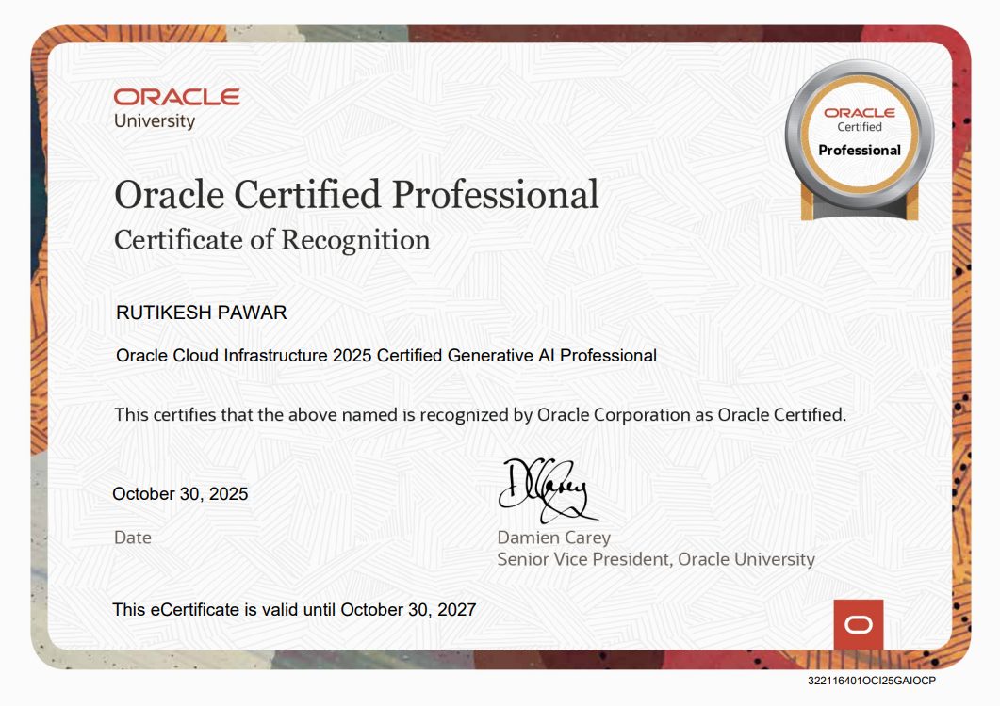

🏅 Badge Preview:  

### 🎯 Skills Validated:
- Generative AI Concepts and Applications  
- Oracle Cloud Infrastructure (OCI) for AI Workloads  
- Prompt Engineering and Model Fine-tuning  
- Responsible AI and Governance  
- AI Data Pipeline and Integration in Oracle Cloud  

---

## ✅ Devtown Certificates
### Python Zero to Hero

### 🏆 Certificate of Appreciation  
- 🔗 [View PDF](./devtown_python_zero_to_hero/devtown_appreciation.pdf)  
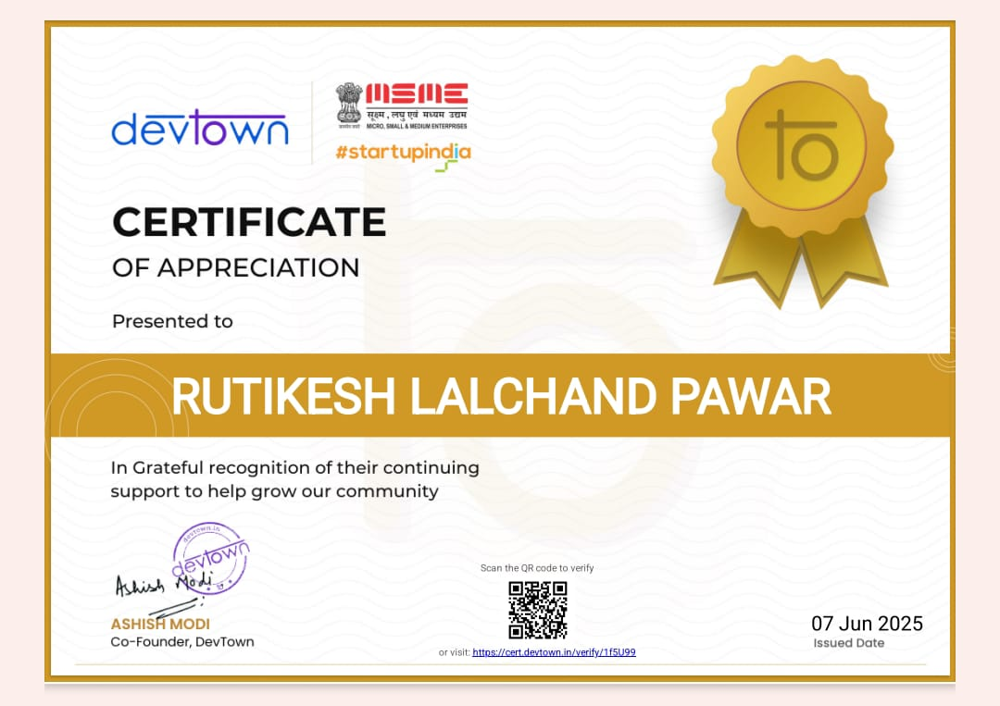

### 🎓 Certification of Participation  
- 🔗 [View PDF](./devtown_python_zero_to_hero/devtown_participation_python_zerotohero.pdf)  
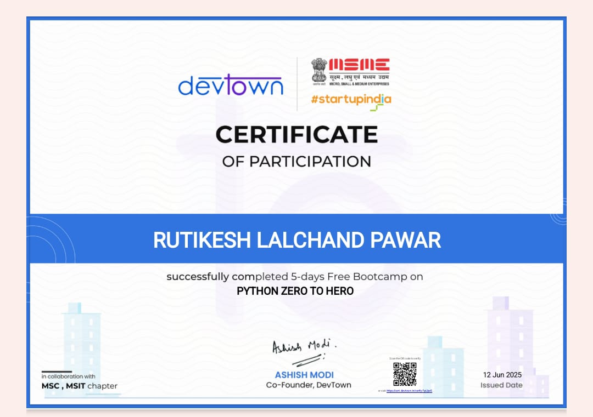

### 💼 Certificate of Project Completion (Devtown)  
- 🔗 [View PDF](./devtown_python_zero_to_hero/devtown_google.pdf)  
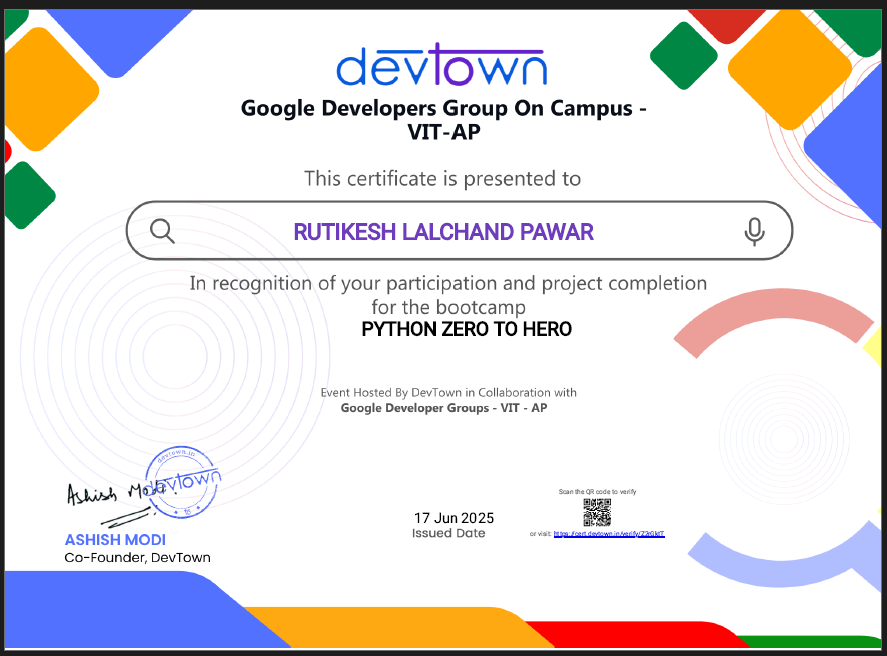

### 🧠 Certificate of Project Completion (Devtown)
- 🔗 [View PDF](./devtown_python_zero_to_hero/devtown_microsoft.pdf)  
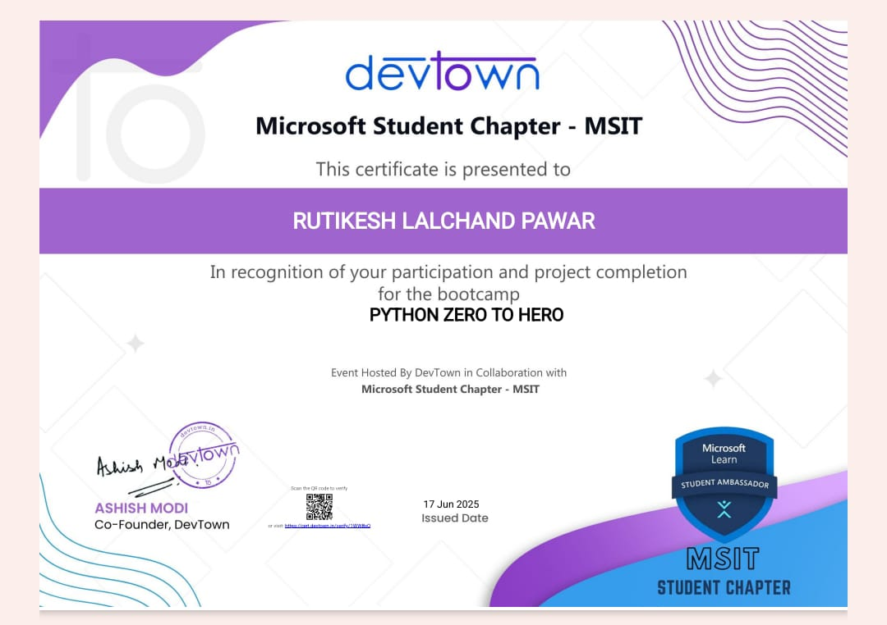

--- 

### 🧾 Devtown - SQL for Analyst Workshop  
- 🔗 [View PDF](./devtown_sql_for_analyst/devtown_sql_analyst.pdf)  
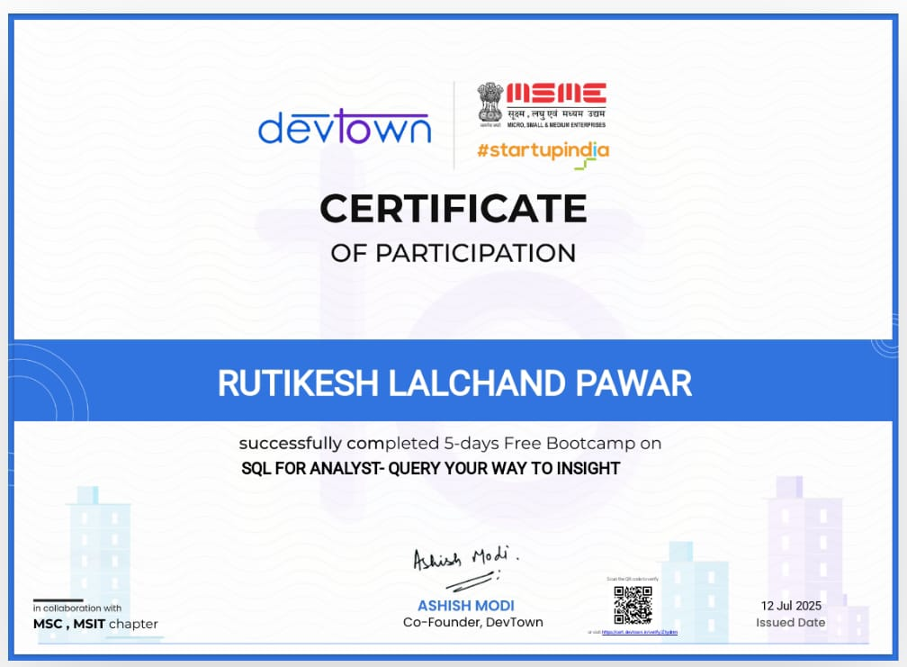

---

## 📊 Simplilearn – Introduction to Data Analytics  
- 🔗 [View PDF](./simplilearn/simplilearn_intro_data_analytics.pdf)  
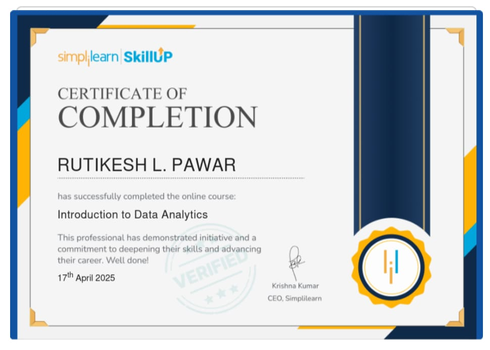

---

## 🧪 Published Research Paper

### 📄 Machine Learning-Based [CROPIFY] – IJCRT  
- 🔗 [View Full Paper (PDF)](https://www.ijcrt.org/papers/IJCRT24A4305.pdf)  
- 🔗 [Official Journal Page](https://ijcrt.org/viewfull.php?&p_id=IJCRT24A4305)
- 🔗 [View PDF](./IJCRT/IJCRT.pdf)
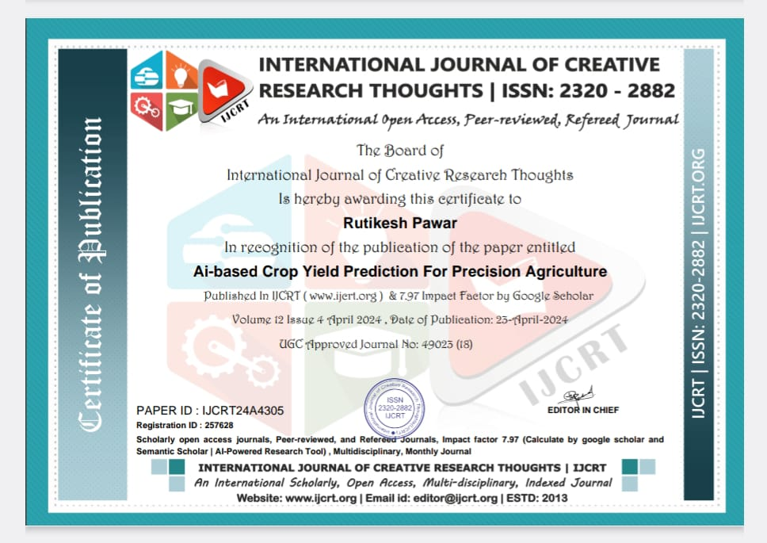

> Published in the International Journal of Creative Research Thoughts (IJCRT), April 2024.  

---

## 🛠️ Guardneer Data Analyst Internship Certificate

- 🔗 [View PDF Certificate](./guardneer_intership/internship_gardneer.pdf)  
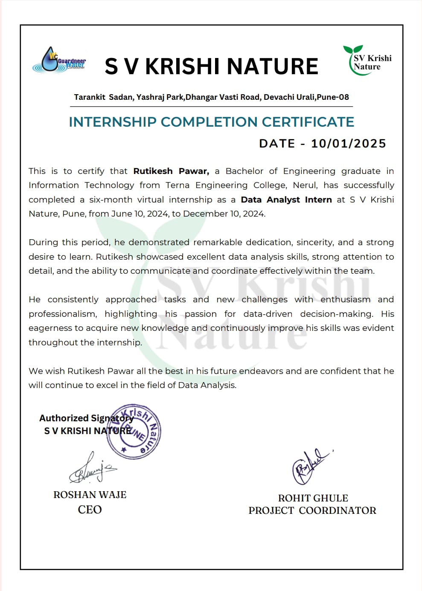

> Completed a 6-month professional internship as a Data Analyst, working on real-world projects in smart farming, water quality analytics, and customer segmentation.
> Tools used: Python, SQL, Excel, Tableau.

## 🛠️ Deloitte Certificate

- 🔗 [View PDF Certificate](https://github.com/rutikeshpawar/Rutikesh-Certificates/blob/734287a4a76a5d2b7ac9bdebdeb39e73a178c285/Deloitte-Certification/Deloitte%20Certification.pdf)  

> ✅ These certifications validate my ongoing learning in data analytics, cloud, SQL, and real-world business intelligence tools.
